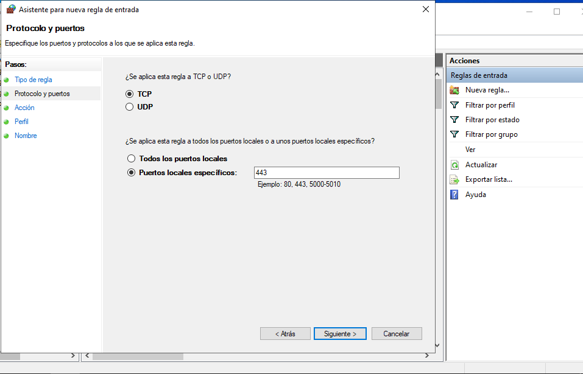

# AWS Hybrid Infrastructure with OpenVPN Integration

[

This project demonstrates the implementation of a secure hybrid cloud infrastructure connecting on-premises Windows Server 2022 with AWS cloud resources via OpenVPN. 
## Table of Contents
- [Introduction](#introduction)
- [Prerequisites](#prerequisites)
- [Step-by-Step Configuration](#step-by-step-configuration)
- [Conclusion](#conclusion)

## Introduction
This project showcases advanced networking skills, security hardening through Group Policy Objects, and cross-platform integration essential for modern enterprise environments.

## Prerequisites
- Windows Server 2022 with Active Directory Domain Services
- Domain: alvaroarroyocompany.com
- AWS Account with appropriate permissions
- OpenVPN client installed on Windows Server
- Basic understanding of TCP/IP networking and VPN protocols

## Step-by-Step Configuration
### 1. Local Security Hardening - Firewall Rules
Rule: Enforce HTTPS for Secure Remote Access
Configured inbound firewall rule to allow secure connections on TCP port 443.
  <!-- Embed imagen -->
  <!-- Embed imagen -->
  <!-- Embed imagen -->
  <!-- Embed imagen -->
  <!-- Embed imagen -->

### 2. AWS Virtual Private Cloud Configuration
Navigated to the AWS Management Console and selected the us-east-2 (Ohio) region for deployment. Accessed the VPC Dashboard through the Services menu and initiated the creation of a new Virtual Private Cloud. Specified the IPv4 CIDR block as 172.31.0.0/16, providing approximately 65,536 available IP addresses for cloud resources. Configured the VPC with default tenancy to optimize cost efficiency.

  <!-- Embed imagen -->

### 3.Subnet Architecture Deployment
Created the first subnet with CIDR block 172.31.0.0/20 in the us-east-2a availability zone, providing 4,096 available IP addresses. Configured this subnet as public by enabling auto-assign public IPv4 addresses, allowing instances to receive public IPs automatically upon launch. Created a second subnet with CIDR block 172.31.16.0/20 in the us-east-2b availability zone, similarly configured as public with the same capacity.

  <!-- Embed imagen -->

### 4. Internet Gateway and Route Table Configuration
Created an Internet Gateway within the VPC to enable communication between VPC resources and the public internet. Attached the Internet Gateway to the VPC, establishing the connection required for outbound internet access and inbound connections to public-facing resources. Modified the main route table associated with the VPC by adding a default route with destination 0.0.0.0/0 pointing to the Internet Gateway, enabling instances in public subnets to reach internet destinations. 
  <!-- Embed imagen -->

### 5. EC2 Instance Launch - OpenVPN Server
Navigated to the EC2 Dashboard and initiated the launch of a new instance. Selected Ubuntu Server 22.04 LTS as the Amazon Machine Image, chosen for its stability, security updates, and compatibility with OpenVPN software. Specified t3.small as the instance type, providing 2 vCPUs and 2GB of RAM, which meets the requirements for handling VPN traffic and routing operations for a small to medium deployment. Created a new key pair for SSH authentication, downloading the private key file and securing it appropriately for future administrative access. Configured network settings by selecting the previously created VPC and choosing a public subnet to ensure the instance receives a public IP address.

### 6. Security Group Configuration for OpenVPN Server
During the EC2 instance launch process, created a dedicated security to control network access and configured inbound rules.This security group configuration implements the principle of least privilege while maintaining operational flexibility for VPN operations and system administration.

### 7. OVPN File
Following the deployment of the EC2 instance, its OpenVPN configuration file was retrieved and customized to reflect the specific parameters of the associated VPC. This tailored configuration enabled the establishment of a secure connection between the on-premises infrastructure and AWS resources via the OpenVPN protocol.

### 7. VPN Connection 
Once the OVPN configuration file was finalized, the connection process was initiated, confirming a successful handshake. The assigned IP address was properly registered, and the server was successfully listed among the active clients within the OpenVPN interface.

## Conclusion
This project delivered a secure hybrid connectivity solution by integrating an on-premises Windows Server 2022 environment with AWS resources through an OpenVPN-based VPN, establishing reliable network routing and controlled access between both domains.

## Key Achievements
- Secure connectivity established between on-premises infrastructure and AWS using a customized OpenVPN configuration.

- VPC and subnet architecture deployed with public subnets, appropriate CIDR sizing, and an Internet Gateway to support required routing.

- Least-privilege network controls implemented via targeted Security Group and Windows firewall rules.

- Operational validation completed: successful VPN handshake, IP assignment, client registration, and ICMP reachability tests.
  

Contact me for freelance opportunities at iam.alvaroarroyo@outlook.com or via Upwork.

